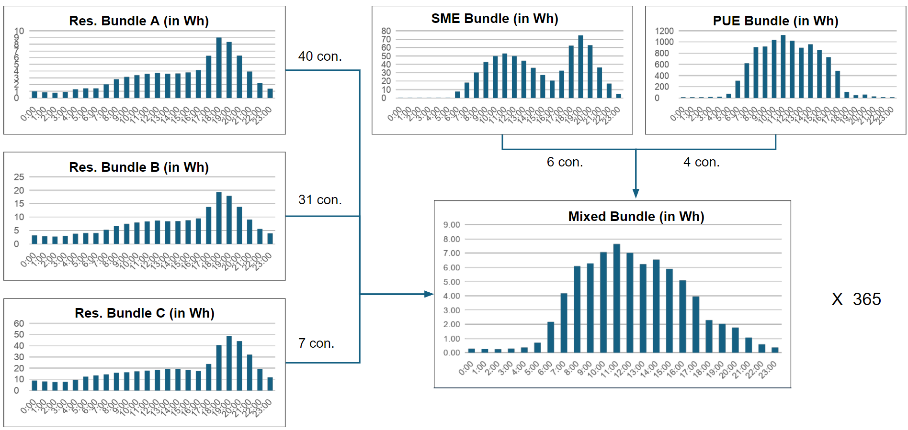

Electricity Demand module
====================================================

Load characterization
**********************

Load characterization is an important component of mini grid sizing. In the OMG model we assumed five customer types by default, namely:

* **Residential Bundle A** -> Low consumption residential customers
* **Residential Bundle B** -> Average consumption residential customers
* **Residential Bundle C** -> High consumption residential customers
* **SME Bundle** -> Consumption related to Small and Medium Enterprises
* **PUoE Bundle** -> Consumption related Productive Use of Electricity (agriculture, social, public etc.)

There are two options available in the OMG model currently:

**Option 1:** Estimate based on building type and archetypes

In this option the total load is estimated using an estimate of customers per bundle (using the building footprints) and predefined load archetypes. The distribution of buildings into the different bundles can be determined by the user. Here the default values derive from empirical observations in 25 sites in Zambia. That is, 47% of structure were classified as Residential Bundle A, 35% as Residential Bundle B, 8% as Residential Bundle C, 8% under the SME Bundle and ~2% under the PUE bundle. The user can modify these values as/if required.

The aggregation of customers per bundle and load profiles leads to a mixed daily load profile, which is then multiplied by 365 to create a yearly load profile, which is - in turn - used in the mini-grid optimization module.

   Indicative load profile archetypes for common type of mini-grid customers

.. note::
   A more elaborate description of the load archetypes is available in the `sample load archetypes <https://github.com/SEforALL-IEAP/OMG/blob/main/Input_data/sample_load_archetypes.xlsx>`_ file under the Input data directory on GitHub. 

**Option 2:** Detailed annual hourly load profile from surveys

In case the user prefers to provide the hourly profiles for the entire year (8760 time slices) there is an option to do so by reading the data directly from a csv-file. Note that the units should be in Watts (W).
